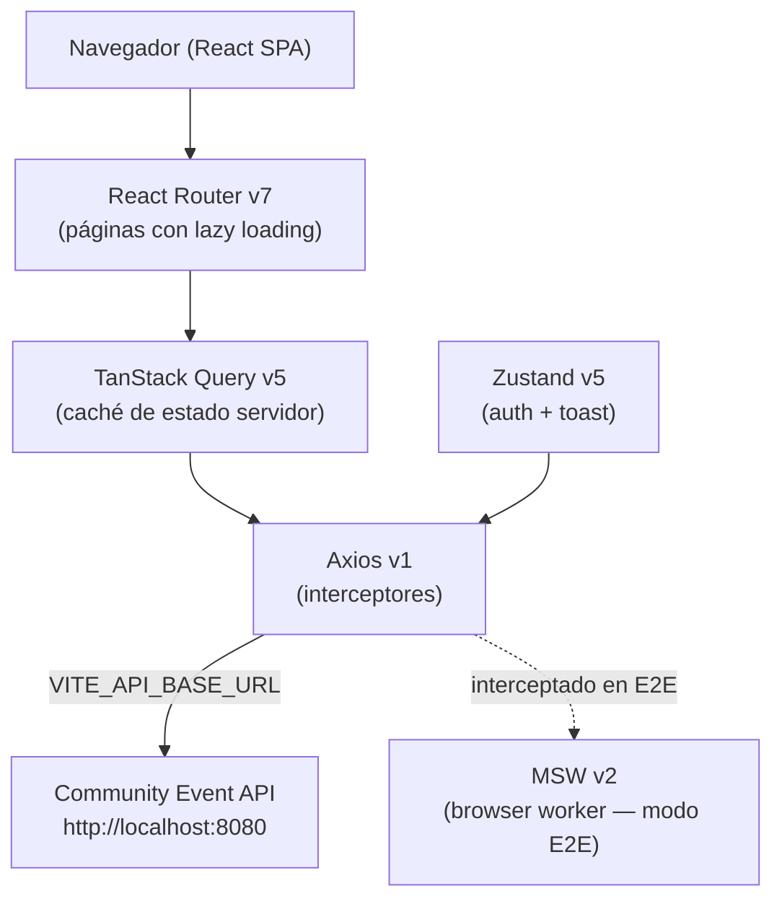
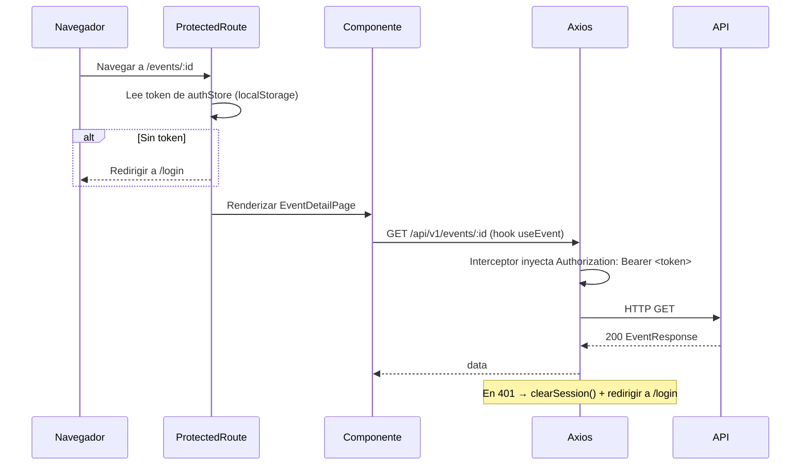

> [Read in English](PLATFORM.md)

# Plataforma CMS Admin

CMS Admin es el front-end de administración del sistema de gestión de eventos de la comunidad GDG Aranjuez. Proporciona al equipo organizador una interfaz autenticada unificada para crear y mantener eventos y todos sus recursos asociados: ponentes, colaboradores, desarrolladores, organizadores, patrocinadores y tracks de agenda.

La plataforma es una SPA React que se comunica exclusivamente con la API REST Community Event. Todo el estado se obtiene bajo demanda mediante TanStack Query o se almacena en Zustand. No hay renderizado en servidor.

---

## Arquitectura del sistema



### Flujo de petición autenticada



---

## Arquitectura de componentes

### Estructura basada en features

Cada dominio de negocio reside en `src/features/<domain>/` y es completamente autocontenido:

```
src/features/<domain>/
  types.ts                       Esquemas Zod + tipos DTO de TypeScript
  services/<domain>Service.ts    Llamadas Axios — una función por endpoint
  hooks/use<Domain>s.ts          useQuery (lista paginada)
  hooks/use<Domain>Mutations.ts  useToastMutation (crear / actualizar / eliminar)
  components/<Domain>ListPage.tsx  Página CRUD completa — tabla + modal formulario + modal borrado
  components/<Domain>Form.tsx      Formulario con React Hook Form + Zod
  index.ts                       Re-exportaciones públicas
```

Los sub-recursos (collaborators, developers, organizers, speakers, sponsors, tracks) delimitan todas las queries y la invalidación de caché al `eventId` correspondiente:

```
collaboratorsKeys.byEvent(eventId)  →  ['collaborators', eventId]
```

### `EventDetailPage` — hub de gestión

La página de detalle de evento actúa como hub. Renderiza:

1. **Cabecera del evento** — nombre, slug, `EventStatusBadge`, fechas, botón Editar
2. **Grid de contadores resumen** — 6 queries paralelas de solo conteo (`pageSize: 1` para leer únicamente `meta.total`)
3. **Componente Tabs** — una pestaña por sub-recurso, cada una embebe el `ListPage` correspondiente con `embedded={true}`

La prop `embedded` en cada `ListPage` de sub-recurso oculta el breadcrumb y el título, que serían redundantes dentro de una pestaña.

### Catálogo de componentes UI compartidos

| Componente     | Descripción                                                                                            |
| -------------- | ------------------------------------------------------------------------------------------------------ |
| `Avatar`       | Imagen circular con fallback de iniciales                                                              |
| `Badge`        | Chip de estado — variantes: `default`, `success`, `warning`, `danger`, `info`                          |
| `Button`       | Variantes primary / secondary / ghost / danger; estado `loading` con spinner                           |
| `EmptyState`   | Placeholder para tabla vacía con título y descripción                                                  |
| `ErrorMessage` | Muestra errores de API con callback opcional de reintento                                              |
| `Input`        | Campo de texto con etiqueta y error de validación en línea                                             |
| `Modal`        | Diálogo accesible — tamaños `sm` / `md` / `lg`                                                         |
| `Pagination`   | Navegador de páginas + selector de tamaño, controlado por `PagedMeta`                                  |
| `Skeleton`     | Placeholder animado con pulso; `TableSkeleton` para estado de carga de tablas                          |
| `Spinner`      | Indicador de carga — tamaños `sm` / `md` / `lg`                                                        |
| `Table`        | Tabla genérica tipada — muestra `TableSkeleton` al cargar, `EmptyState` si está vacía                  |
| `Tabs`         | Panel de pestañas con montaje diferido — se monta al primer acceso y permanece montado; soporta badges |
| `Toast`        | `ToastContainer` renderiza los toasts activos; se auto-descarta a los 4 segundos                       |

### División de código (code splitting)

Cada componente de página se carga con `React.lazy` + `Suspense`. El spinner `PageLoader` se muestra mientras se cargan los chunks. Cada página de sub-recurso es su propio chunk asíncrono, lo que mantiene el bundle inicial pequeño.

---

## Gestión del estado

### Modelo de tres capas

| Capa            | Tecnología                | Qué gestiona                                                         |
| --------------- | ------------------------- | -------------------------------------------------------------------- |
| Estado local    | `useState` / `useReducer` | Apertura de formularios, fila seleccionada, parámetros de paginación |
| Estado servidor | TanStack Query v5         | Todos los datos de API — eventos, personas, sub-recursos             |
| Estado global   | Zustand v5                | Sesión de autenticación, notificaciones toast                        |

### TanStack Query — convenciones de query keys

Cada feature define un objeto `*Keys`:

```ts
export const eventsKeys = {
  all: ['events'] as const,
  paged: (params) => ['events', 'paged', params] as const,
  detail: (id) => ['events', 'detail', id] as const,
}
```

Los sub-recursos añaden una clave `byEvent` para invalidación delimitada:

```ts
collaboratorsKeys.byEvent(eventId) // se invalida tras cualquier mutación de colaborador
```

**Valores por defecto de caché** (`queryClient.ts`):

- `staleTime`: 5 minutos — evita refetches innecesarios al cambiar de pestaña del navegador
- `retry`: 1 — un reintento en caso de fallo de red
- `refetchOnWindowFocus`: false

**`useEventSummary`** ejecuta 6 queries paralelas de solo conteo (`pageSize: 1`) para rellenar el grid resumen sin traer datasets completos.

### Stores de Zustand

| Store        | Persistencia                    | Contenido                                                       |
| ------------ | ------------------------------- | --------------------------------------------------------------- |
| `authStore`  | `localStorage` clave `cms-auth` | `token`, `user` (`email`, `role`), `setSession`, `clearSession` |
| `toastStore` | Ninguna (solo memoria)          | `toasts[]`, `add(message, variant)`, `remove(id)`               |

El objeto `toast` (`src/store/toastStore.ts`) es un helper imperativo utilizable fuera de componentes React — se usa dentro de los callbacks de `useToastMutation`.

### Estrategia de mocks con MSW

| Contexto                 | Modo MSW                  | Activado por                               |
| ------------------------ | ------------------------- | ------------------------------------------ |
| Tests unitarios (Vitest) | Node — `setupServer`      | `src/test-setup.ts` — `server.listen()`    |
| Tests E2E (Playwright)   | Navegador — `setupWorker` | `VITE_MSW=true` en `.env.e2e` → `main.tsx` |

Cada dominio tiene su propio fichero de handlers (`mocks/handlers/<domain>.handlers.ts`) y un dataset mutable en memoria con un helper `reset*Db()` que se llama en `beforeEach`.

---

## Autenticación y seguridad

### Flujo de login

La autenticación está predefinida para la fase debug actual. No existe un endpoint de login en el backend.

1. El usuario envía email + contraseña en `LoginForm`
2. `loginWithCredentials()` valida contra una lista hardcodeada
3. Si es válido, se devuelve un token JWT falso y se almacena en `authStore` mediante `setSession()`
4. El middleware `persist` de Zustand escribe `{ token, user }` en `localStorage` bajo la clave `cms-auth`
5. Al recargar la página, el token se restaura automáticamente desde `localStorage`

### Cadena de interceptores Axios

```
Petición saliente
  └── Interceptor de petición — lee token de authStore.getState().token
  └── Inyecta: Authorization: Bearer <token>
  └── API

Respuesta entrante
  └── Interceptor de respuesta
  └── En HTTP 401 → authStore.clearSession() + window.location.href = '/login'
```

### Guardia ProtectedRoute

`src/app/ProtectedRoute.tsx` envuelve todas las rutas autenticadas. Lee `token` de `authStore`; si no existe, redirige a `/login` guardando la `location` original en el estado del router para restaurarla tras el login.

---

## Servicios

| Servicio                    | Rol                                                          | Tecnología                  |
| --------------------------- | ------------------------------------------------------------ | --------------------------- |
| Community Event API         | API REST del backend — toda la persistencia de datos         | Go, `http://localhost:8080` |
| MSW (dev/test)              | Mock de API en proceso — intercepta todas las llamadas Axios | MSW v2                      |
| Servidor de desarrollo Vite | Empaqueta y sirve la SPA en desarrollo                       | Vite 8, puerto 5173         |

---

## Capa de datos

### Tecnología

| Preocupación                  | Elección                                         |
| ----------------------------- | ------------------------------------------------ |
| Comunicación con la API       | Axios v1 con URL base de `VITE_API_BASE_URL`     |
| Caché de respuestas           | TanStack Query v5 — 5 minutos de stale time      |
| Validación de formularios     | Esquemas Zod v4 compilados con React Hook Form   |
| Persistencia de autenticación | Middleware `persist` de Zustand → `localStorage` |

### Decisiones de diseño clave

**`order_priority_str` en SponsorForm** — `z.coerce.number()` de Zod acepta `unknown` como tipo de entrada, lo que provoca un desajuste de tipos con `zodResolver`. El esquema del formulario usa `order_priority_str: z.string()` con una validación regex; el valor numérico se convierte manualmente en `handleValid()` antes de llamar al servicio.

**`usePersonsList` — caché compartida para selectores de persona** — cuatro sub-recursos (collaborators, developers, organizers, speakers) necesitan rellenar un `<select>` con la lista completa de personas. Un único hook `usePersonsList` con `staleTime: 5 min` sirve a los cuatro sin peticiones de red duplicadas.

**Alcance de la invalidación de mutaciones** — las mutaciones de sub-recursos invalidan `byEvent(eventId)` (no la clave global `all`), limitando el impacto en la caché solo a los datos del evento relevante.

---

## Enlaces esenciales

| Recurso            | Ubicación                                                      |
| ------------------ | -------------------------------------------------------------- |
| Repositorio        | https://github.com/JRamonCarralero/cms-admin-claude            |
| API Backend        | https://github.com/JRamonCarralero/cms-back-claude             |
| Vitest UI          | http://localhost:51204 (iniciado con `pnpm test:ui`)           |
| Informe Playwright | `playwright-report/index.html` (generado tras `pnpm test:e2e`) |
