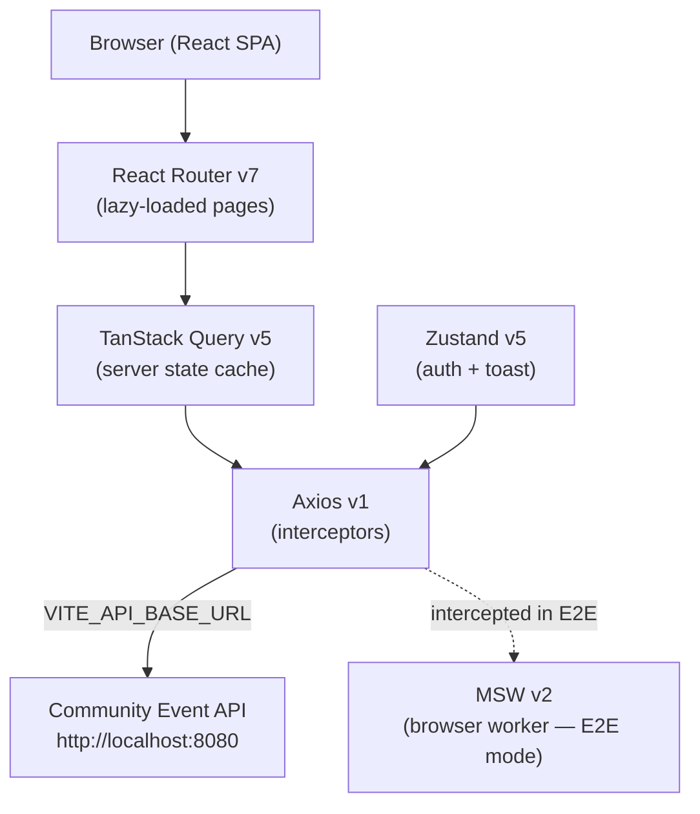
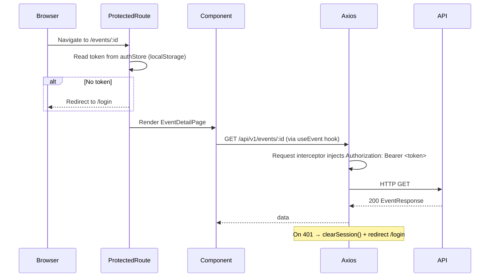

> [Leer en español](PLATFORM.es.md)

# CMS Admin Platform

CMS Admin is the administration front-end for the GDG Aranjuez community event management system. It gives the event team a single authenticated interface to create and maintain events and all their associated people and logistics: speakers, collaborators, developers, organizers, sponsors, and schedule tracks.

The platform is a React SPA that communicates exclusively with the Community Event REST API. All state is either fetched on demand via TanStack Query or stored in Zustand. There is no server-side rendering.

---

## System Architecture



### Request Flow (authenticated)



---

## Component Architecture

### Feature-based folder structure

Each business domain lives under `src/features/<domain>/` and is fully self-contained:

```
src/features/<domain>/
  types.ts                Zod schemas + TypeScript DTO types
  services/<domain>Service.ts   Axios calls — one function per endpoint
  hooks/use<Domain>s.ts         useQuery (paginated list)
  hooks/use<Domain>Mutations.ts useToastMutation (create / update / delete)
  components/<Domain>ListPage.tsx  Full CRUD page — table + form modal + delete modal
  components/<Domain>Form.tsx      React Hook Form + Zod form
  index.ts                Public re-exports
```

Sub-resources (collaborators, developers, organizers, speakers, sponsors, tracks) scope all queries and cache invalidation to their `eventId`:

```
collaboratorsKeys.byEvent(eventId)  →  ['collaborators', eventId]
```

### `EventDetailPage` — dashboard hub

The event detail page acts as a hub. It renders:

1. **Event header** — name, slug, `EventStatusBadge`, created/updated dates, Edit button
2. **Summary counters grid** — 6 parallel count queries (`pageSize: 1` to read only `meta.total`)
3. **Tabs component** — one tab per sub-resource, each embedding the corresponding `ListPage` with `embedded={true}`

The `embedded` prop on every sub-resource `ListPage` hides the breadcrumb and title, which would be redundant inside a tab.

### Shared UI component catalogue

| Component      | Description                                                                        |
| -------------- | ---------------------------------------------------------------------------------- |
| `Avatar`       | Circular image with initials fallback                                              |
| `Badge`        | Status chip — variants: `default`, `success`, `warning`, `danger`, `info`          |
| `Button`       | Primary / secondary / ghost / danger variants; `loading` spinner state             |
| `EmptyState`   | Empty table placeholder with title and description                                 |
| `ErrorMessage` | API error display with optional retry callback                                     |
| `Input`        | Labelled text input with inline validation error                                   |
| `Modal`        | Accessible dialog — `sm` / `md` / `lg` sizes                                       |
| `Pagination`   | Page navigator + page-size selector, driven by `PagedMeta`                         |
| `Skeleton`     | Animated pulse placeholder; `TableSkeleton` for table loading state                |
| `Spinner`      | Loading indicator — `sm` / `md` / `lg` sizes                                       |
| `Table`        | Generic typed table — shows `TableSkeleton` while loading, `EmptyState` when empty |
| `Tabs`         | Lazy-mount tab panel — mounts on first visit, stays mounted; supports badges       |
| `Toast`        | `ToastContainer` renders active toasts; auto-dismisses after 4 seconds             |

### Code splitting

Every page component is loaded via `React.lazy` + `Suspense`. The `PageLoader` spinner is shown while chunks load. This keeps the initial bundle small — each sub-resource page is its own async chunk.

---

## State Management

### Three-layer model

| Layer        | Technology                | What it owns                                     |
| ------------ | ------------------------- | ------------------------------------------------ |
| Local state  | `useState` / `useReducer` | Form open/close, selected row, pagination params |
| Server state | TanStack Query v5         | All API data — events, persons, sub-resources    |
| Global state | Zustand v5                | Auth session, toast notifications                |

### TanStack Query — key conventions

Every feature defines a `*Keys` object:

```ts
export const eventsKeys = {
  all: ['events'] as const,
  paged: (params) => ['events', 'paged', params] as const,
  detail: (id) => ['events', 'detail', id] as const,
}
```

Sub-resources add a `byEvent` key for scoped invalidation:

```ts
collaboratorsKeys.byEvent(eventId) // invalidated after any collaborator mutation
```

**Cache defaults** (`queryClient.ts`):

- `staleTime`: 5 minutes — prevents redundant refetches on tab focus
- `retry`: 1 — one retry on network failure
- `refetchOnWindowFocus`: false

**`useEventSummary`** runs 6 parallel count-only queries (`pageSize: 1`) to populate the summary grid without fetching full datasets.

### Zustand stores

| Store        | Persistence                   | Contents                                                        |
| ------------ | ----------------------------- | --------------------------------------------------------------- |
| `authStore`  | `localStorage` key `cms-auth` | `token`, `user` (`email`, `role`), `setSession`, `clearSession` |
| `toastStore` | None (memory only)            | `toasts[]`, `add(message, variant)`, `remove(id)`               |

The `toast` object (`src/store/toastStore.ts`) is an imperative helper callable outside React components — used inside `useToastMutation` callbacks.

### MSW mock strategy

| Context                | MSW mode                | Activated by                               |
| ---------------------- | ----------------------- | ------------------------------------------ |
| Unit tests (Vitest)    | Node — `setupServer`    | `src/test-setup.ts` — `server.listen()`    |
| E2E tests (Playwright) | Browser — `setupWorker` | `VITE_MSW=true` in `.env.e2e` → `main.tsx` |

Each domain has its own handler file (`mocks/handlers/<domain>.handlers.ts`) and an in-memory mutable dataset with a `reset*Db()` helper called in `beforeEach`.

---

## Auth & Security

### Login flow

Authentication is hardcoded for the current debug phase. No backend login endpoint exists.

1. User submits email + password in `LoginForm`
2. `loginWithCredentials()` validates against a hardcoded list
3. On success, a fake JWT token is returned and stored in `authStore` via `setSession()`
4. Zustand `persist` middleware writes `{ token, user }` to `localStorage` under the key `cms-auth`
5. On page reload, the token is restored automatically from `localStorage`

### Axios interceptor chain

```
Outgoing request
  └── Request interceptor — reads token from authStore.getState().token
  └── Injects: Authorization: Bearer <token>
  └── API

Incoming response
  └── Response interceptor
  └── On HTTP 401 → authStore.clearSession() + window.location.href = '/login'
```

### ProtectedRoute guard

`src/app/ProtectedRoute.tsx` wraps all authenticated routes. It reads `token` from `authStore`; if absent, it redirects to `/login` with the original `location` saved in router state so it can be restored after login.

---

## Services

| Service             | Role                                             | Technology                  |
| ------------------- | ------------------------------------------------ | --------------------------- |
| Community Event API | Backend REST API — all data persistence          | Go, `http://localhost:8080` |
| MSW (dev/test)      | In-process API mock — intercepts all Axios calls | MSW v2                      |
| Vite dev server     | Bundles and serves the SPA in development        | Vite 8, port 5173           |

---

## Data Layer

### Technology

| Concern           | Choice                                          |
| ----------------- | ----------------------------------------------- |
| API communication | Axios v1 with base URL from `VITE_API_BASE_URL` |
| Response caching  | TanStack Query v5 — 5-minute stale time         |
| Form validation   | Zod v4 schemas compiled with React Hook Form    |
| Auth persistence  | Zustand `persist` middleware → `localStorage`   |

### Key design decisions

**`order_priority_str` in SponsorForm** — Zod's `z.coerce.number()` accepts `unknown` as input, which causes a type mismatch with `zodResolver`. The form schema uses `order_priority_str: z.string()` with a regex refinement; the numeric value is coerced manually in `handleValid()` before calling the service.

**`usePersonsList` — shared person selector cache** — four sub-resources (collaborators, developers, organizers, speakers) need to populate a `<select>` with the full persons list. A single `usePersonsList` hook with `staleTime: 5 min` serves all four without duplicate network requests.

**Mutation invalidation scope** — sub-resource mutations invalidate `byEvent(eventId)` (not the global `all` key), limiting cache churn to the relevant event's data only.

---

## Essential Links

| Resource          | Location                                                         |
| ----------------- | ---------------------------------------------------------------- |
| Repository        | https://github.com/JRamonCarralero/cms-admin-claude              |
| Backend API       | https://github.com/JRamonCarralero/cms-back-claude               |
| Vitest UI         | http://localhost:51204 (started with `pnpm test:ui`)             |
| Playwright report | `playwright-report/index.html` (generated after `pnpm test:e2e`) |
